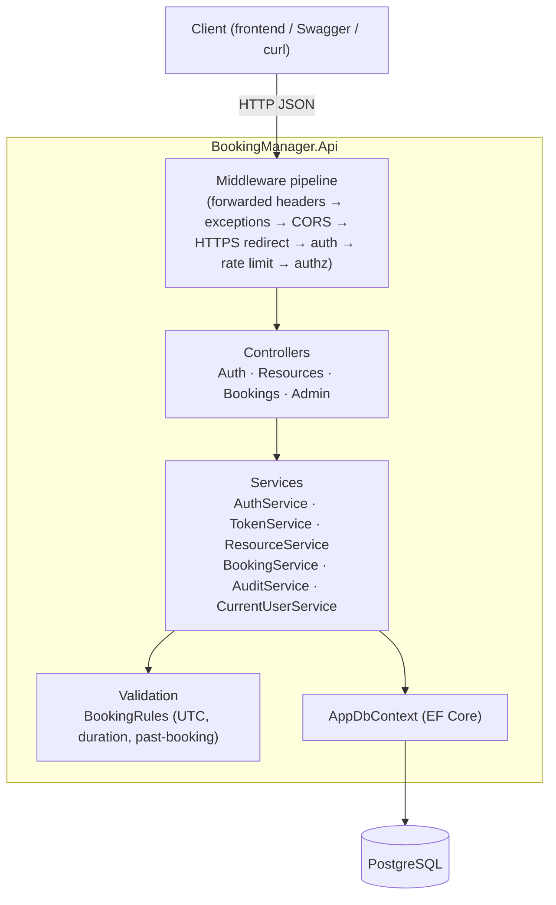
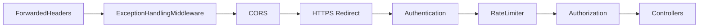
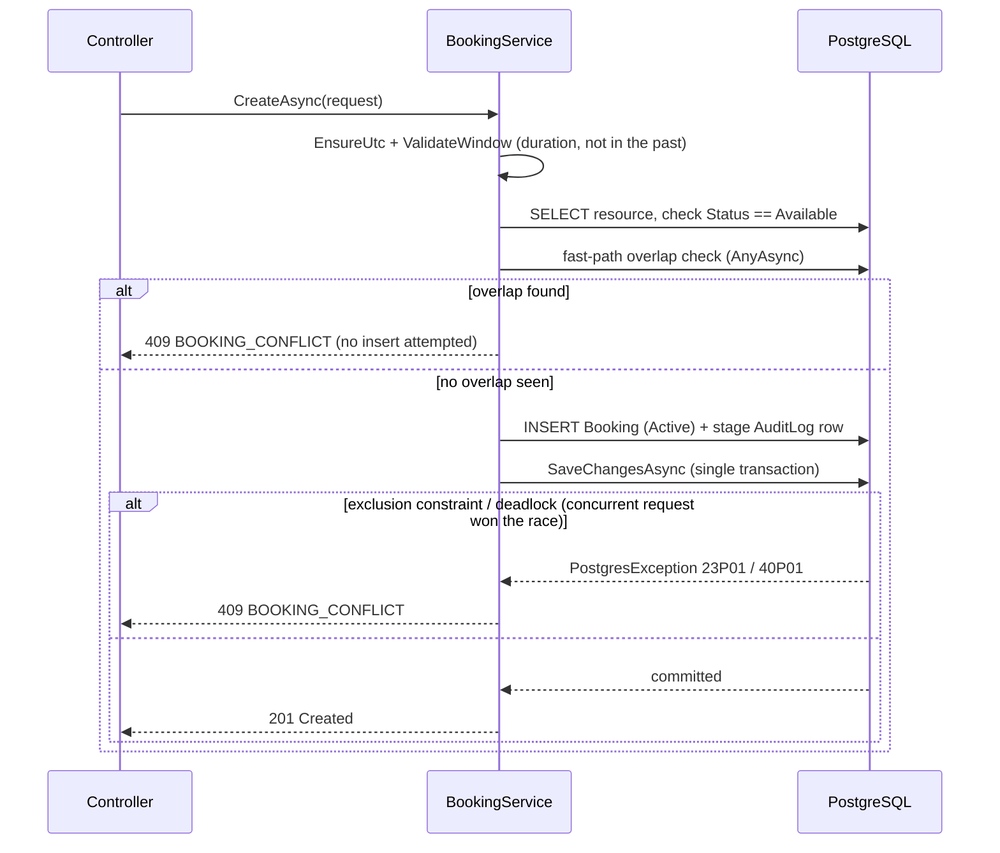
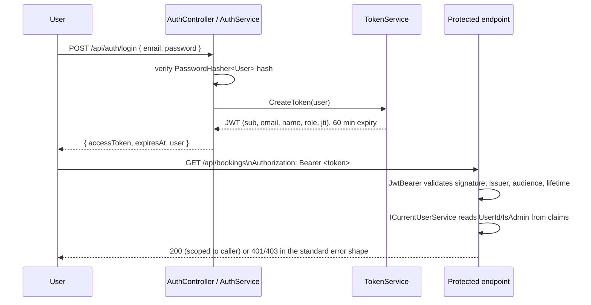
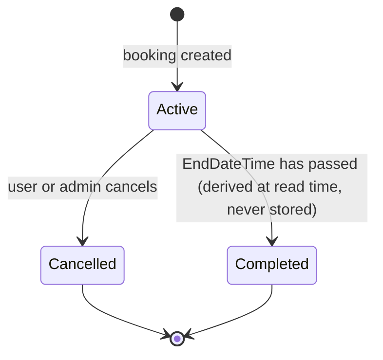
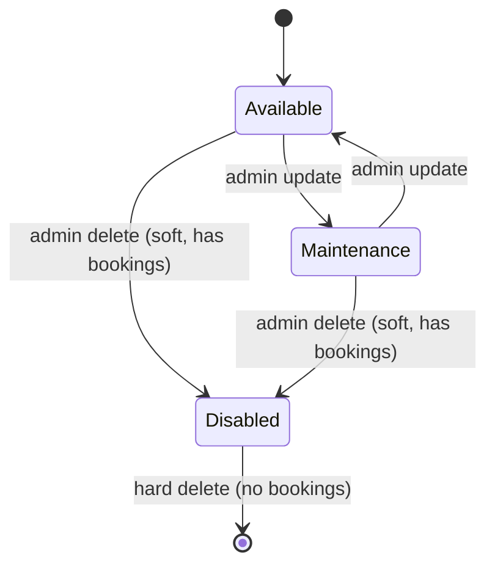

# Backend

.NET 10 Web API. Controllers are thin; all business logic lives in services. There's no separate repository layer — EF Core's `DbContext` already is a unit-of-work, and another layer on top would add indirection without value at this size.

## Layered architecture



## Request pipeline (exact `Program.cs` order)



`ExceptionHandlingMiddleware` sits early so it wraps everything downstream: any `ApiException` subtype (`NotFoundException`, `BookingOverlapException`, `ConflictException`, `UnauthorizedException`, `DomainValidationException`, ...) is mapped to its declared HTTP status and the shared error shape; anything else is logged in full server-side and surfaces only a generic `500 INTERNAL_ERROR` — no stack traces or SQL ever reach the client.

## Response shape

Every successful response is wrapped consistently:

```json
// single item
{ "data": { "id": "...", "name": "Conference Room A" } }

// paged list
{ "data": [ ... ], "meta": { "page": 1, "pageSize": 20, "totalCount": 42, "totalPages": 3 } }
```

Every error, from any source (domain exception, DataAnnotations validation, JWT challenge, rate limit), shares one shape:

```json
{ "code": "BOOKING_CONFLICT", "message": "This resource is already booked during the selected time." }
```

## Endpoints

| Method | Route | Access | Notes |
|---|---|---|---|
| POST | `/api/auth/register` | public | Returns a JWT immediately (no email verification step). |
| POST | `/api/auth/login` | public | Same error for unknown email vs. wrong password (no account enumeration). |
| POST | `/api/auth/logout` | any authenticated user | Stateless — client discards the token. |
| GET | `/api/resources?type=&status=` | any authenticated user | Served from a 5-minute in-memory cache. |
| GET | `/api/resources/{id}` | any authenticated user | |
| GET | `/api/resources/{id}/availability?from=&to=&durationMinutes=` | any authenticated user | Free-slot search, capped at 31 days. |
| POST / PUT / DELETE | `/api/resources[/{id}]` | admin only | Delete is soft (`Disabled`) if the resource has bookings, hard otherwise. |
| POST | `/api/bookings` | any authenticated user | Owner is always taken from the JWT, never the request body. |
| GET | `/api/bookings?resourceId=&from=&to=&status=&page=&pageSize=` | any authenticated user | Own bookings only. |
| GET | `/api/bookings/{id}` | owner or admin | Returns 404 (not 403) for another user's booking — no ID probing. |
| POST | `/api/bookings/{id}/cancel` | owner or admin | |
| GET | `/api/admin/bookings?...` | admin only | All users' bookings. |
| GET | `/api/admin/audit-logs?...` | admin only | Every mutation, with before/after JSON snapshots. |

## Booking creation: the two-layer overlap guard



The `AnyAsync` pre-check is a UX optimization — fast, friendly 409s for the common case. It is **not** race-safe by itself; the database's exclusion constraint (see [`database.md`](database.md)) is what actually prevents two overlapping `Active` bookings from ever coexisting, and the service walks the full exception chain to catch both the exclusion violation and the deadlock Postgres can raise instead depending on timing.

## Authentication flow



Passwords are hashed with ASP.NET Identity's `PasswordHasher<User>` (salted PBKDF2), used standalone — there's no full ASP.NET Identity/EF Identity schema, just a plain `User` model and a hand-rolled `AuthService`/`TokenService`.

## Cross-cutting concerns

- **Authorization**: `[Authorize]` on every controller except auth; an `AdminOnly` policy (`RequireRole(Admin)`) gates resource writes and the admin controller.
- **Rate limiting**: tiered fixed-window policies — `auth` (5/min/IP, brute-force resistance), `booking-write` (10/min/user-or-IP), `reads` (100/min/user-or-IP), plus a 200/min/IP global ceiling. All configurable under `RateLimiting` in `appsettings.json`.
- **Audit logging**: `AuditService.Log(...)` stages a row on the *same* `DbContext` as the change it describes, so it's written in the same `SaveChangesAsync` call — log and data can never diverge.
- **Caching**: the resource list is cached in-memory for 5 minutes and invalidated on every write; availability is deliberately never cached since it changes with every booking.

## Status state machines




