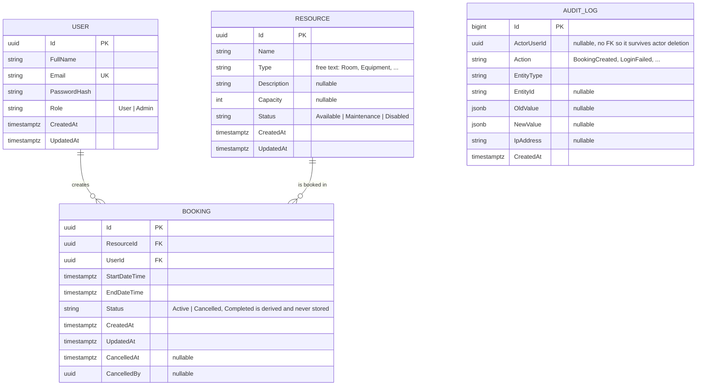
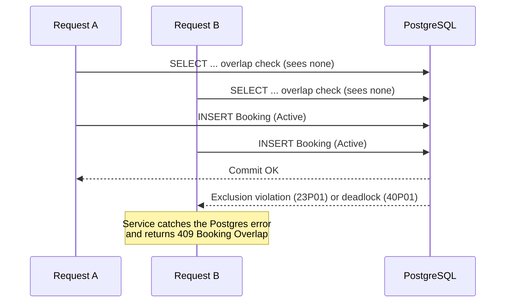

# Database

PostgreSQL via EF Core (Npgsql). One migration (`InitialCreate`) creates the full schema, seeds the resource catalog, and adds the concurrency-safety constraint described below. `dotnet ef database update` — or just `docker compose up`, which runs migrations automatically on API startup — brings a fresh database fully up to date.

## Entity-relationship diagram



`AuditLog` deliberately has no foreign key to `User` — an audit trail has to survive the actor being deleted, so `ActorUserId`/`EntityId` are plain values, not navigable relationships.

## Why a `Booking` isn't just start/end + resource

| Column | Reason |
|---|---|
| `Status` (`Active`/`Cancelled`) | Soft-cancel: a cancelled booking stays in the table for history/audit but no longer blocks the slot. |
| `CancelledAt` / `CancelledBy` | Who cancelled it and when — needed for the audit trail and for admin visibility into user-initiated vs admin-initiated cancellations. |
| No stored `Completed` | `Completed` is *derived* at read time (`Active` booking whose `EndDateTime` has passed) instead of written by a background job. One less moving part, and a completed booking can never conflict with a new one by definition. |

## Indexes

| Index | Table | Columns | Purpose |
|---|---|---|---|
| `IX_Users_Email` | Users | `Email` (unique) | Login lookup, and enforces one account per email. |
| `IX_Bookings_ResourceId_TimeRange` | Bookings | `ResourceId, StartDateTime, EndDateTime` | General overlap/availability queries. |
| `IX_Bookings_Active_ResourceId_TimeRange` | Bookings | `ResourceId, StartDateTime, EndDateTime` **partial**, `WHERE Status = 'Active'` | The hot path — only active bookings can conflict, so the index only needs to cover them. |
| `IX_Bookings_UserId_StartDateTime` | Bookings | `UserId, StartDateTime` | "My bookings" list, sorted. |
| `IX_AuditLogs_CreatedAt` | AuditLogs | `CreatedAt` | Chronological admin browsing. |
| `IX_AuditLogs_EntityType_EntityId` | AuditLogs | `EntityType, EntityId` | "History for this booking/resource" lookups. |

## The concurrency guard: a PostgreSQL exclusion constraint

A check-then-insert overlap check in application code has a race: two concurrent requests for the same resource and time window can both pass the check before either commits. Rather than trust application code alone, the database itself refuses the second row:

```sql
CREATE EXTENSION IF NOT EXISTS btree_gist;

ALTER TABLE "Bookings" ADD CONSTRAINT "EX_Bookings_ResourceId_TimeRange"
EXCLUDE USING gist (
    "ResourceId" WITH =,
    tstzrange("StartDateTime", "EndDateTime") WITH &&
) WHERE ("Status" = 'Active');
```



Only `Active` rows participate in the constraint — a cancelled booking frees its slot automatically, no cleanup job required. `CK_Bookings_Status_Persisted` (`Status IN ('Active','Cancelled')`) additionally guarantees `Completed` can never be written to the column it's derived from.

See the [README's design write-up](../README.md#design-write-up) for the fuller discussion of why this beats optimistic concurrency or advisory locks for this specific race.

## Seed data

Eight resources are seeded via `HasData` in the migration (deterministic GUIDs so the seed is identical across environments):

| Name | Type | Capacity | Status |
|---|---|---|---|
| Conference Room A | Room | 12 | Available |
| Conference Room B | Room | 6 | Available |
| Projector | Equipment | — | Available |
| Meeting Pod 1 | Room | 4 | Available |
| Electronics Lab | Lab | 20 | Available |
| MacBook Pro Loaner | Equipment | — | Available |
| 3D Printer | Equipment | — | Maintenance |
| Hot Desk 42 | Workspace | 1 | Available |

The 3D Printer is deliberately seeded in `Maintenance` so the "resource not bookable" path is visible in the demo.

Users and bookings are seeded at application startup rather than in a migration — password hashes are salted (non-deterministic) and demo bookings need dates relative to "now", so neither belongs baked into migration history:

- **Admin**: `admin@bookingmanager.local` / `Admin123!` (overridable via `SeedAdmin:Email`/`SeedAdmin:Password`). Always seeded.
- **Demo accounts** (Development environment only, skipped once any non-admin user exists): `alice@bookingmanager.local` and `bob@bookingmanager.local`, both `Password1!`, with 8 sample bookings over the next two days — including a back-to-back pair on Conference Room A (proving the boundary rule) and one cancelled booking (proving a cancelled slot no longer blocks the resource).
