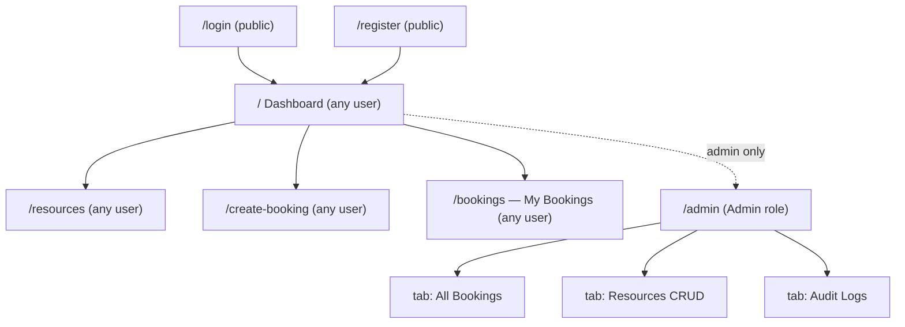
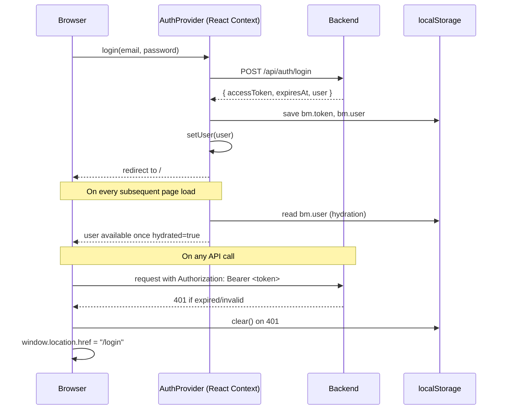
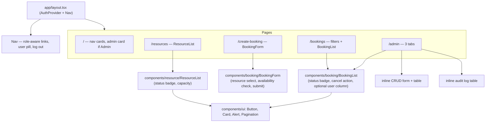
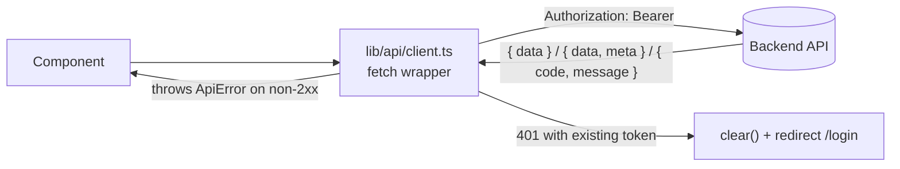

# Frontend

Next.js (App Router) + TypeScript, no auth/state-management/form libraries — a hand-rolled `AuthProvider` context, plain `useState`/`useEffect` data fetching, and a small typed `fetch` wrapper. Kept intentionally simple: this exercises the API end to end, it isn't a polished product.

## Routes and access control



`/admin` is a single page with three client-side tabs (not separate routes) — `AdminBookings`, `AdminResources`, `AdminAuditLogs` are local components inside `app/admin/page.tsx`.

Access control is enforced entirely by a client-side `<RequireAuth>` wrapper component — there is **no** Next.js `middleware.ts`, so protected pages' JS still ships to an unauthenticated browser before the redirect fires (a brief "Loading..." flash is expected, not a bug).

## Auth flow



Session storage is plain `localStorage` (keys `bm.token`, `bm.user`) — no cookies, no server-side session. A global `401` from any API call forces a full logout + redirect, so an expired token can't leave the UI in a half-authenticated state.

## Component structure



## Data flow: API client



`lib/api/` is split by resource: `auth.ts`, `bookings.ts` (also holds `adminApi` for admin bookings/audit-log endpoints), `resources.ts`. Response types in `lib/types/common.ts` mirror the backend's envelope exactly: `ApiEnvelope<T> = { data: T }` and `Paged<T> = { data: T[], meta: PageMeta }`.

## Key types

```ts
type BookingStatus = "Active" | "Cancelled" | "Completed";
type ResourceStatus = "Available" | "Maintenance" | "Disabled";
type UserRole = "User" | "Admin";

interface Booking {
  id: string; resourceId: string; resourceName: string | null; userId: string;
  startDateTime: string; endDateTime: string; status: BookingStatus;
  cancelledAt: string | null; cancelledBy: string | null;
}
```

These mirror the backend's `BookingStatus`/`ResourceStatus` enums and DTO shapes exactly — see [`backend.md`](backend.md) for the source of truth.

## Notable UX details

- `BookingForm` filters the resource dropdown to `status === "Available"` only, and has a "check availability" action that calls `GET /api/resources/{id}/availability` to show free slots before submitting.
- `BookingList` shows a color-coded status badge and only renders the Cancel button when `status === "Active"`.
- Datetime inputs are plain `datetime-local` fields; `lib/utils/date.ts` converts the local input to a UTC ISO string on the way out and formats ISO timestamps back to the viewer's local time for display.
